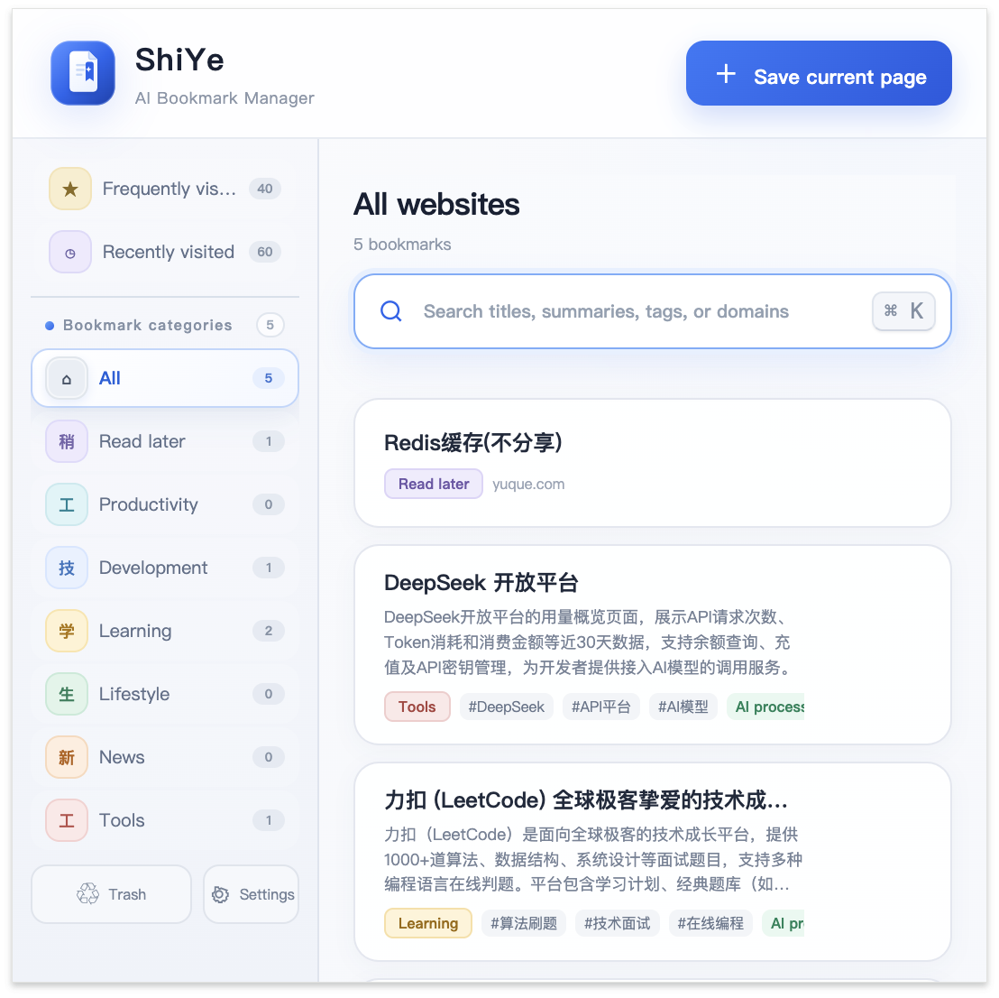
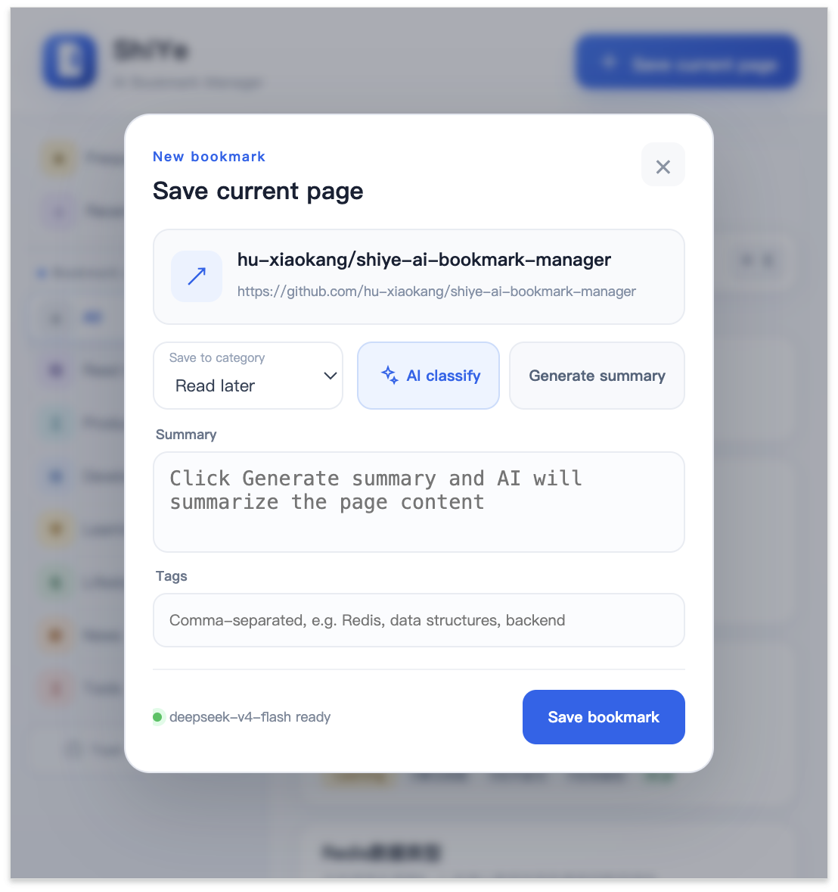
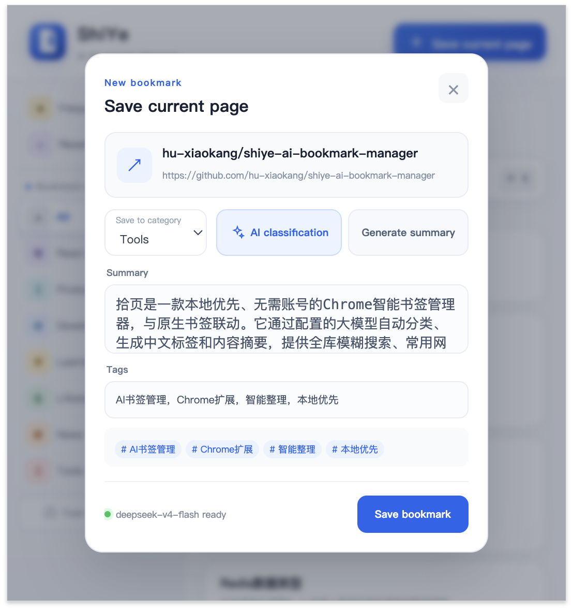

# ShiYe · AI Bookmark Manager

<p align="center">
  
</p>

> English | [简体中文](README.md)

ShiYe is a local-first Chrome bookmark manager that requires no account. It synchronizes with native Chrome bookmarks and uses a model configured by the user to classify pages, generate tags and summaries, and organize a growing bookmark library.

## Screenshots

<p align="center">
  
</p>

<table>
  <tr>
    <td width="50%"></td>
    <td width="50%"></td>
  </tr>
  <tr>
    <td align="center">Save the current page</td>
    <td align="center">AI classification, summary, and tags</td>
  </tr>
</table>

## Highlights

- **Local first**: bookmarks, settings, and browsing metrics stay in the current browser.
- **Bring your own key**: works with OpenAI Chat Completions-compatible APIs.
- **Chrome bookmark sync**: listens for native bookmark creation, updates, and deletion.
- **AI organization**: automatically generates categories, tags, and complete summaries.
- **High-speed search**: searches titles, summaries, tags, categories, URLs, and domains.
- **Reliable data management**: trash, duplicate merging, safety snapshots, and import preview.
- **Multilingual**: Simplified Chinese and English are included, with an extensible language resource system.
- **No build step**: plain HTML, CSS, and JavaScript.

## Installation

1. Download or clone this repository.
2. Open `chrome://extensions/` in Chrome.
3. Turn on **Developer mode**.
4. Click **Load unpacked** and select this project folder.
5. Pin the ShiYe extension and open it.

## Model configuration

Open **Settings → Model** and enter:

- **API URL**: a service root, `/v1` URL, or a complete `/chat/completions` endpoint.
- **API Key**: a key issued by your model provider.
- **Model name**: for example `gpt-4o-mini`, `deepseek-chat`, or another compatible model.

Test the connection before saving. The API key is stored only in `chrome.storage.local` in the current browser.

## Language settings

Open **Settings → Interface language** and choose one of the following:

- **Follow browser**: automatically uses Chinese or English according to Chrome's UI language.
- **简体中文**
- **English**

The selected language also controls the language requested for AI-generated tags and summaries. Existing bookmark category values are kept stable, so changing the interface language does not break filtering or old backups.

### Adding another language

1. Add a translation table to `resources` in `i18n.js`.
2. Add the locale code to the `supported` array and `normalizeLanguage()`.
3. Add the language option to `options.html`.
4. Add Chrome manifest messages under `_locales/<locale>/messages.json`.
5. Add localized AI prompt handling in `popup.js` and `background.js` when the new language should also control generated content.

Untranslated strings fall back to Simplified Chinese, so a new locale can be introduced incrementally.

## Features

- Save and edit the current page.
- Edit bookmark titles, URLs, categories, summaries, and tags.
- Automatically classify, tag, and summarize pages with AI.
- Full-library fuzzy search with `⌘/Ctrl + K` or `/` to focus.
- Frequently visited ranking based on visit frequency, recency, typed visits, and active browsing time.
- Recently visited pages ordered strictly by the latest visit time.
- Custom categories with distinct colors.
- Native Chrome bookmark synchronization.
- Local model usage statistics, including requests, success rate, and tokens.
- Trash with undo, restore, permanent deletion, and 30-day retention.
- Duplicate URL detection and merging.
- Safe JSON export, import preview, merging, replacement, and safety snapshots.

## Privacy

Bookmarks, browsing metrics, and settings are stored locally. Browsing history is used only for the frequently and recently visited views. Page titles, URLs, and readable page content are sent only to the model endpoint configured by the user when an AI feature runs.

See [PRIVACY.md](PRIVACY.md) for details.

## Project structure

```text
├── manifest.json        # Chrome Manifest V3 manifest
├── i18n.js              # Runtime language resources and translation helper
├── _locales/            # Chrome extension name, description, and action translations
├── background.js        # Bookmark sync, AI queue, and browsing metrics
├── popup.html/js/css    # Main extension interface
├── options.html/js/css  # Settings and data management
├── assets/              # Logo and other assets
└── icons/               # Chrome extension icons
```

## Development and contribution

No dependencies or build command are required. After editing the project, reload the extension on `chrome://extensions/`.

Issues and pull requests are welcome. Read [CONTRIBUTING.md](CONTRIBUTING.md) before contributing and see [SECURITY.md](SECURITY.md) for security reports.

## License

[MIT](LICENSE)
